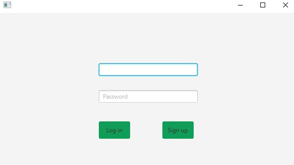
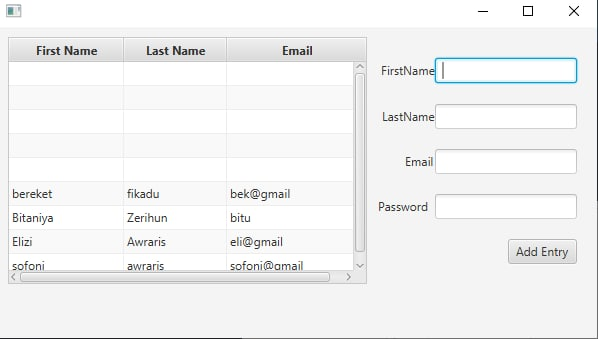
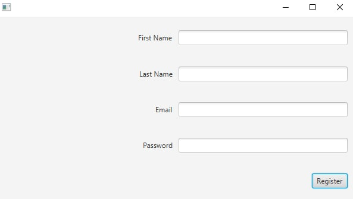

# JavaFX Based Login System

---

## 👉 Requirements

- JDK - 17.0.2

- JavaFX SDK - 17.0.2

- mysql-connector-java-8.0.29

## vmArgs Setup

```
----module-path \"C:\\Program Files\\Java\\javafx-sdk-17.0.2\\lib\" --add-modules javafx.controls,javafx.fxml

```

👉 Sample screenshots taken

<br>

<br>

<br>

​


